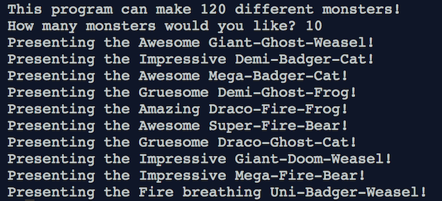

## Introduction

In this project you'll be making a random monster generator. It will create a list of original monster names from parts you put into it! Who knows, maybe one will inspire your next Halloween costume!

### What you will make

A monster generator that will create such original creatures as the fire breathing mega-doom-cat, or the fearsome greater-draco-weasel. 



### What you need to remember

This project is for people who've already completed the Beginner Python Sushi Cards, or otherwise learned the basics of Python. Here's a quick reminder of what you'll need to know:

#### Sequence of code
Python reads your code from top to bottom. You can't use anything earlier in the program than you created it. So, for example, you can't use the value of a **variable** before you've actually created that variable and put the value in it.

#### Variables
Variables are the labels used to store values, such as text or numbers, so you can use them later in the program.

```python
my_variable = 'Some text I want to remember'
another_variable = 42
```

#### Comments
Anything that follows a hash (`#`) character is a comment and will be ignored by Python until the end of the line. You can use comments to leave yourself, or other programmers, notes. This can be really helpful when you open up a program after a few weeks, months, or even years of not looking at it!

```python
# This is a note on its own line
my_variable = 'Some text I want to remember' # This note could remind me why the text is important
```

#### Indents are important
Python uses indenting (spaces in from the side) of your code to understand when things are inside other things, for example the code inside a **loop** or a conditional statement.

```python
# no indent
  # one indent
    # two indents
```

#### Printing
Use the `print()` **function** to display messages to your user.

```python
print('My very important message')
```

#### Getting user input
You get user input using the `input()` function. Don't forget to store it in a variable!

```python
user_name = input('What is your name?')
```

#### While loops
You can use a `while` loop to do the same thing over and over, as long as its condition is **true**.

```python
my_number = 10

while my_number < 20:
  print(my_number)
  my_number = my_number + 1
```
